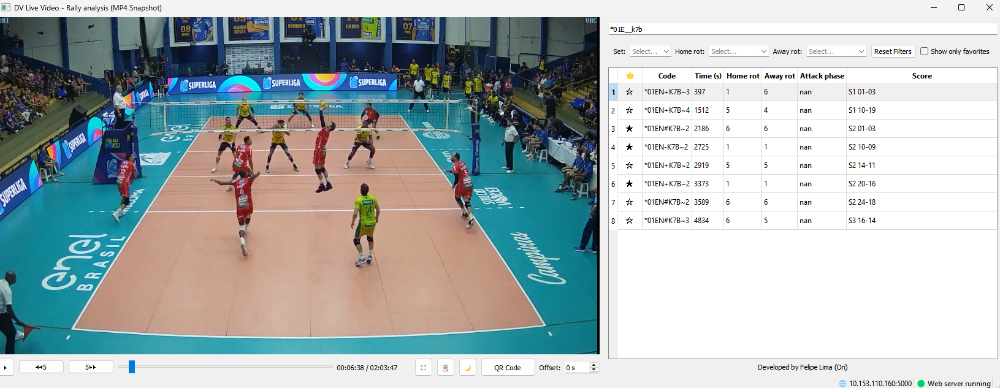
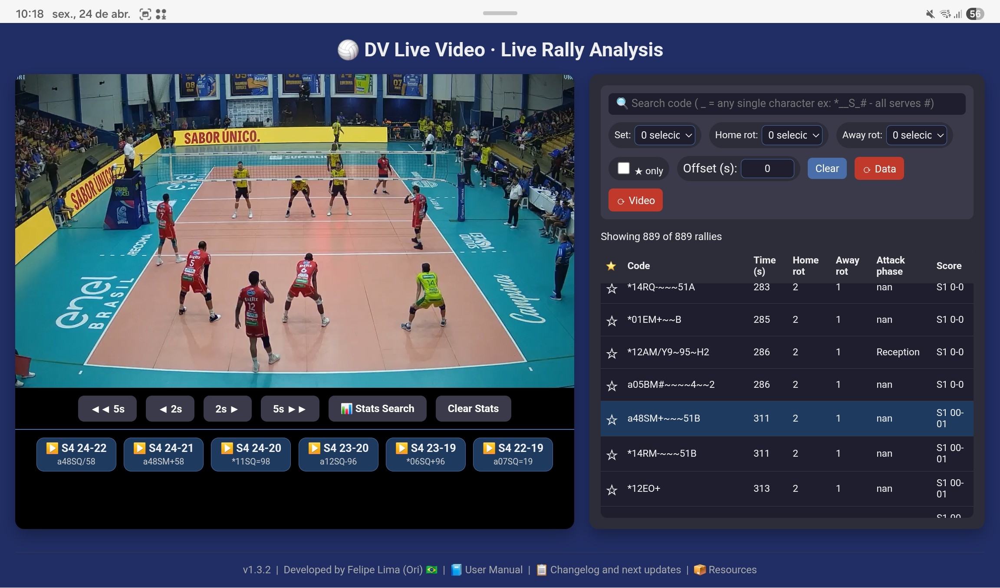

# 🏐 DV Live Video

**DV Live Video** é um aplicativo desktop profissional para análise de rallies de voleibol em tempo real. Ele combina captura de vídeo ao vivo (MP4 parcial ou stream HTTP) com arquivos de scout do DataVolley (`.dvw`) para fornecer uma interface web interativa com filtros avançados, estatísticas e streaming HLS para qualquer dispositivo na sua rede local.

---

**Manual**: 

- [English (US)](manual.md)
- [Português Brasileiro (PT-BR)](manual.ptbr.md)

---

## Screenshots

### Desktop Interface

### Web Interface (Mobile)

---

## Funcionalidades

- **Lista de rallies em tempo real** – Atualizada automaticamente quando o arquivo de scout é modificado.  
- **Filtros avançados** – Por set, rotação casa/fora, favoritos e busca com curinga (`_`).  
- **Estatísticas interativas** – Tabelas detalhadas com contagens por fundamento (Saque, Recepção, Ataque, Bloqueio, Defesa, Levantamento) e códigos de avaliação (`# + ! - / =`).
- **Desktop + Web** – Escolha rodar apenas a interface desktop, apenas o servidor web ou ambos.  
- **Atalhos de teclado** – Espaço (play/pause), setas (±2s), F (favorito), Enter (ir para o rally selecionado), entre outros.  
- **Últimos 6 saques** – Botões dinâmicos exibindo os saques mais recentes com placar e código curto.  

--

## Download

Acesse a página **[Releases](../../releases)** e baixe o arquivo mais recente `DVLiveVideo.rar`. Extraia tudo para o mesmo diretório e execute o `.exe`.

> **Nota:** O pacote de release também inclui o `ffmpeg.exe` e outras pastas e arquivos necessários para o funcionamento. A primeira execução pode levar alguns minutos.

---

## Requisitos

- **Windows 10 / 11** (64 bits)  
- **VLC Media Player** instalado ([download aqui](https://www.videolan.org/vlc/))  
- `ffmpeg.exe` fornecido (incluído no release)  

---

## Início Rápido

1. **Extraia** o arquivo de release para uma pasta (ex.: `C:\DVLiveVideo`).  
2. **Instale o VLC** caso ainda não tenha.  
3. **Execute** `DVLiveVideo.exe`.  
4. Escolha o modo de execução.
5. Selecione a fonte de vídeo.  
6. Comece a análise! A interface web estará disponível em `http://localhost:5000` (ou no IP do seu computador).  

> **Testando sem jogo ao vivo?** Use qualquer `.mp4` + `.dvw`.

---
 
## Desenvolvido com

- **Python 3.14** – Lógica principal  
- **PyQt5** – Interface desktop  
- **VLC (python-vlc)** – Reprodução de vídeo  
- **FFmpeg** – Geração de streaming HLS  
- **Flask + Socket.IO** – Servidor web e atualizações em tempo real  
- **pandas** – Manipulação de dados  
- [**openvolley/py-datavolley**](https://github.com/openvolley/py-datavolley) – Parser de arquivos `.dvw` do DataVolley  

---

## Documentação

A interface web inclui:  
- **Manual do Usuário** – `http://localhost:5000/manual`  
- **Changelog** – `http://localhost:5000/changelog`  
- **Recursos & Créditos** – `http://localhost:5000/resources`  

---

## Contribuição

Este projeto é distribuído como um executável compilado. Se você é desenvolvedor e deseja contribuir com o código-fonte, entre em contato com o autor.

---

## Contato

Desenvolvido por **Felipe Lima (Ori)** – [@felipeaplima]

---

## Licença

Todos os direitos reservados. Este software é fornecido “como está”, sem garantia de qualquer tipo. A redistribuição não é permitida sem autorização explícita do autor.